# FashionFinds

FashionFinds is an e-commerce platform designed to provide users with a seamless shopping experience for the latest fashion trends. Our site offers a wide variety of clothing, accessories, and footwear from various brands.

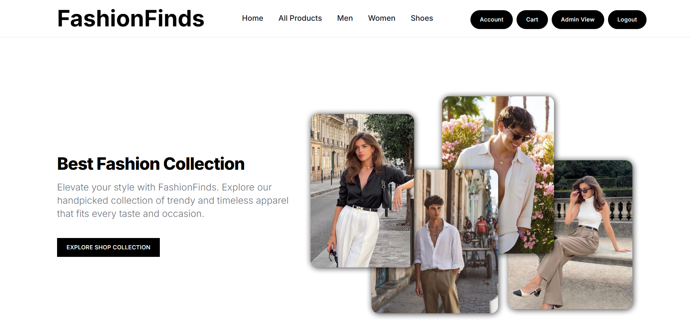


| &nbsp; | &nbsp; |
|---------|---------|
| 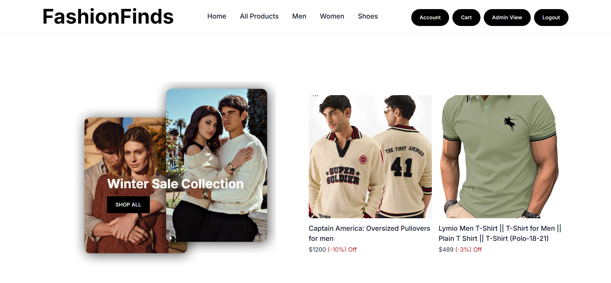 |  | 


## Features

- **User Authentication**: Secure login and registration using JWT tokens.
- **Product Browsing**: Easily navigate through categories and search for products.
- **Shopping Cart**: Add, remove, and update products in your shopping cart.
- **Stripe Integration**: Secure checkout process with Stripe for payment processing.
- **User Profiles**: View and edit user profiles with order history.
- **Responsive Design**: Fully responsive design for optimal viewing on all devices.
- **Admin Panel**: Manage products, orders, and users with an admin interface.

| &nbsp; | &nbsp; | &nbsp; |
|--------|--------|--------|
| 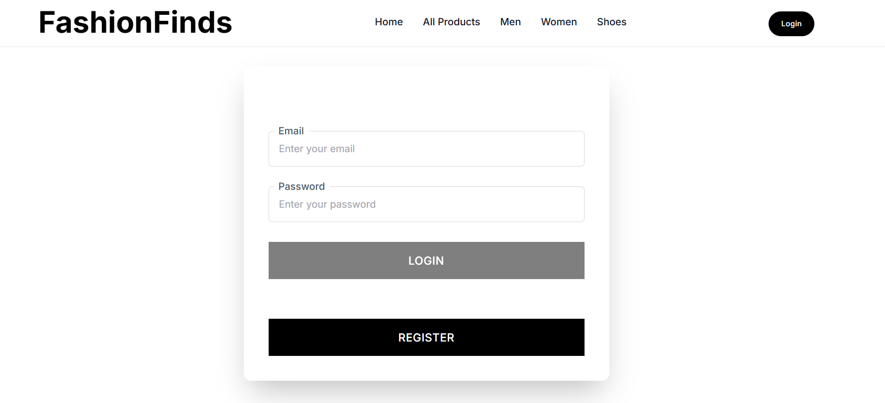 | 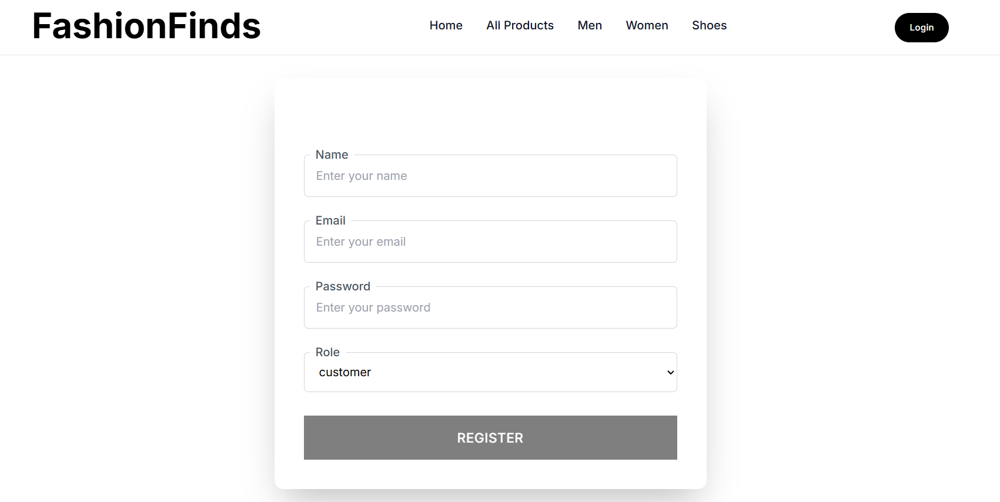 | 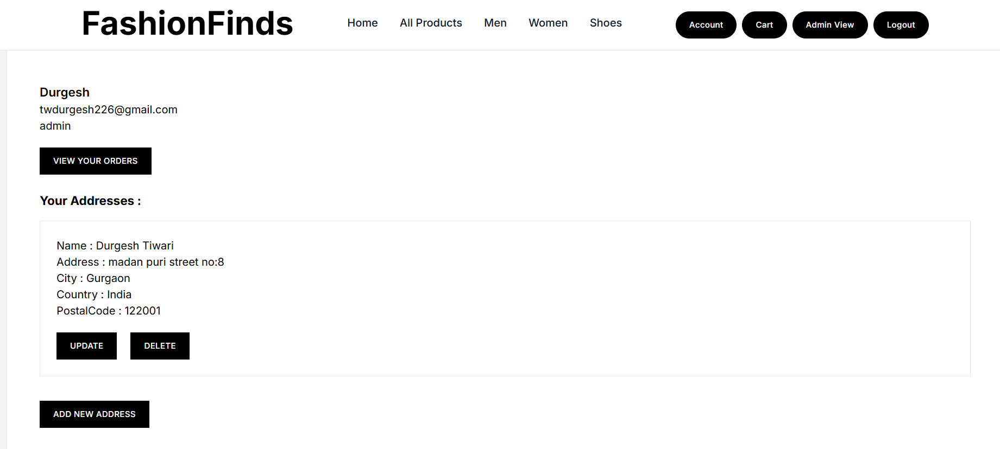 |
| 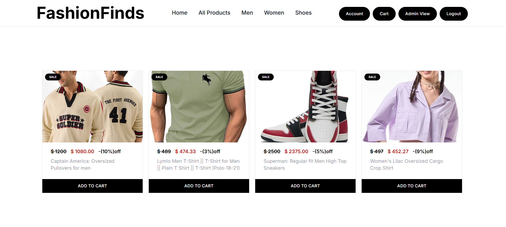 | 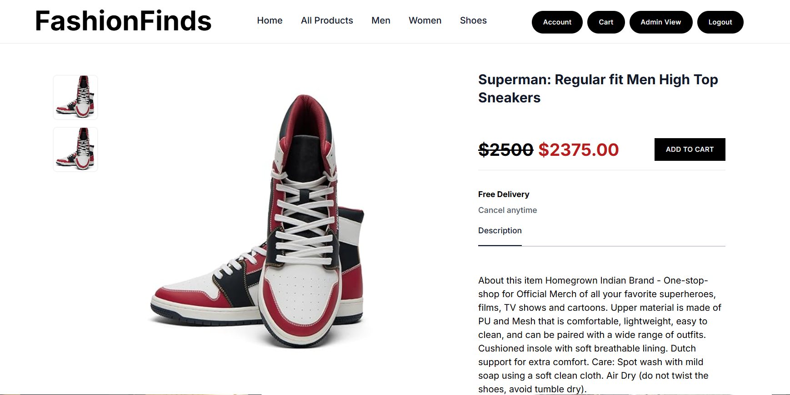 | 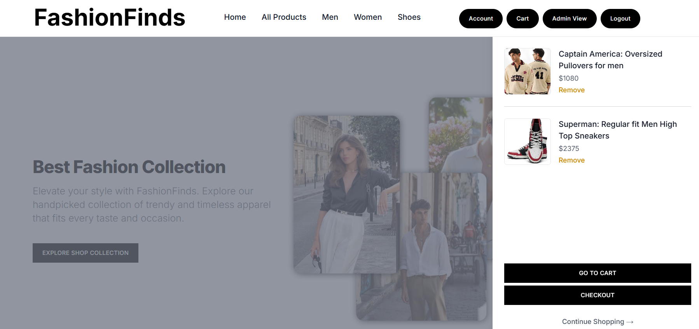 |
| 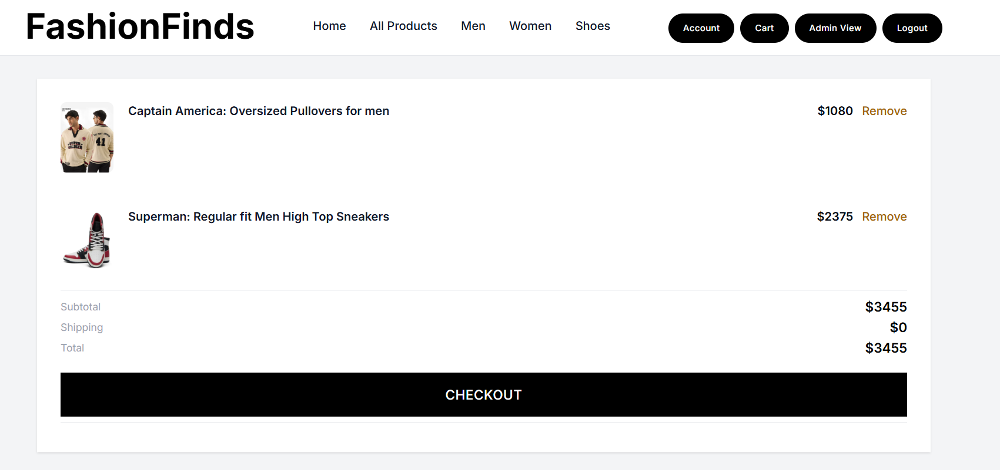 | 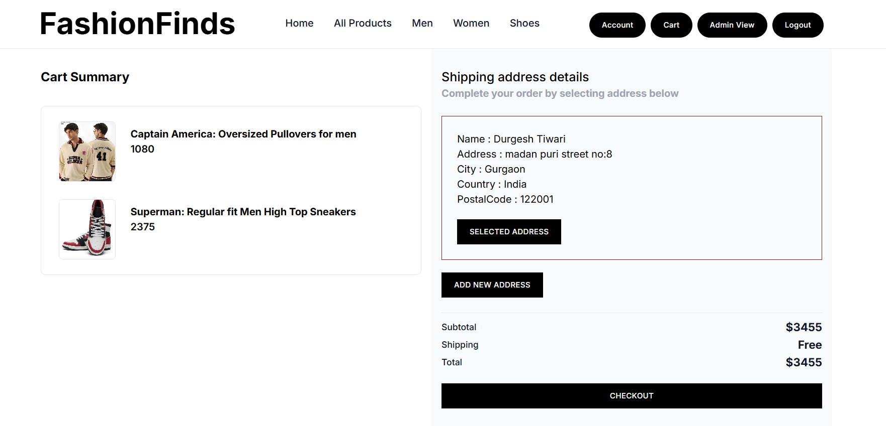 | 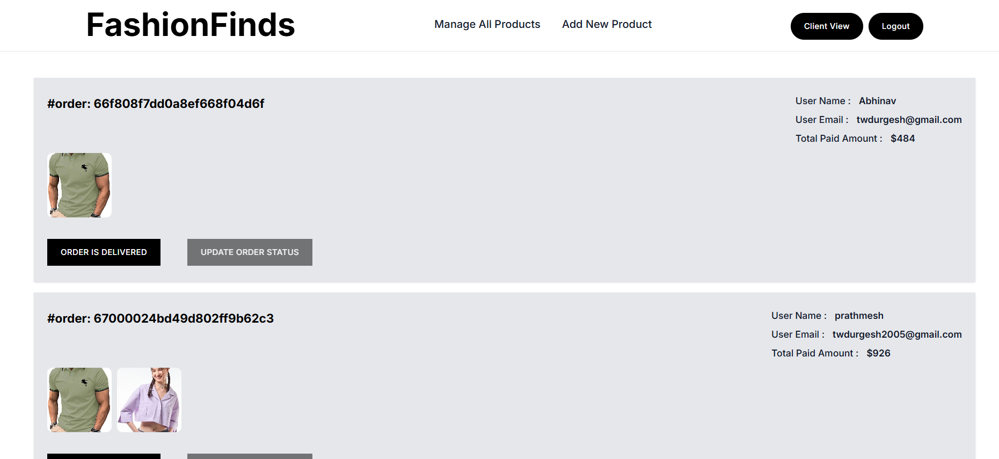 |


## Technologies Used

- **Frontend**: React, Next.js, Tailwind CSS
- **Backend**: Node.js, Express.js
- **Database**: MongoDB, Firebase
- **Payment Gateway**: Stripe
- **Authentication**: JSON Web Tokens (JWT)


This is a [Next.js](https://nextjs.org/) project bootstrapped with [`create-next-app`](https://github.com/vercel/next.js/tree/canary/packages/create-next-app).

## Getting Started

First, run the development server:

```bash
npm run dev
# or
yarn dev
# or
pnpm dev
```

Open [http://localhost:3000](http://localhost:3000) with your browser to see the result.

You can start editing the page by modifying `app/page.js`. The page auto-updates as you edit the file.

This project uses [`next/font`](https://nextjs.org/docs/basic-features/font-optimization) to automatically optimize and load Inter, a custom Google Font.

## Learn More

To learn more about Next.js, take a look at the following resources:

- [Next.js Documentation](https://nextjs.org/docs) - learn about Next.js features and API.
- [Learn Next.js](https://nextjs.org/learn) - an interactive Next.js tutorial.

You can check out [the Next.js GitHub repository](https://github.com/vercel/next.js/) - your feedback and contributions are welcome!

## Deploy on Vercel

The easiest way to deploy your Next.js app is to use the [Vercel Platform](https://vercel.com/new?utm_medium=default-template&filter=next.js&utm_source=create-next-app&utm_campaign=create-next-app-readme) from the creators of Next.js.

Check out our [Next.js deployment documentation](https://nextjs.org/docs/deployment) for more details.
"# E-commerce" 
